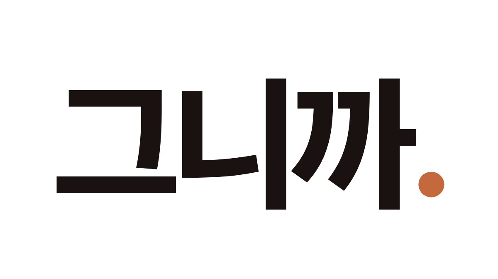
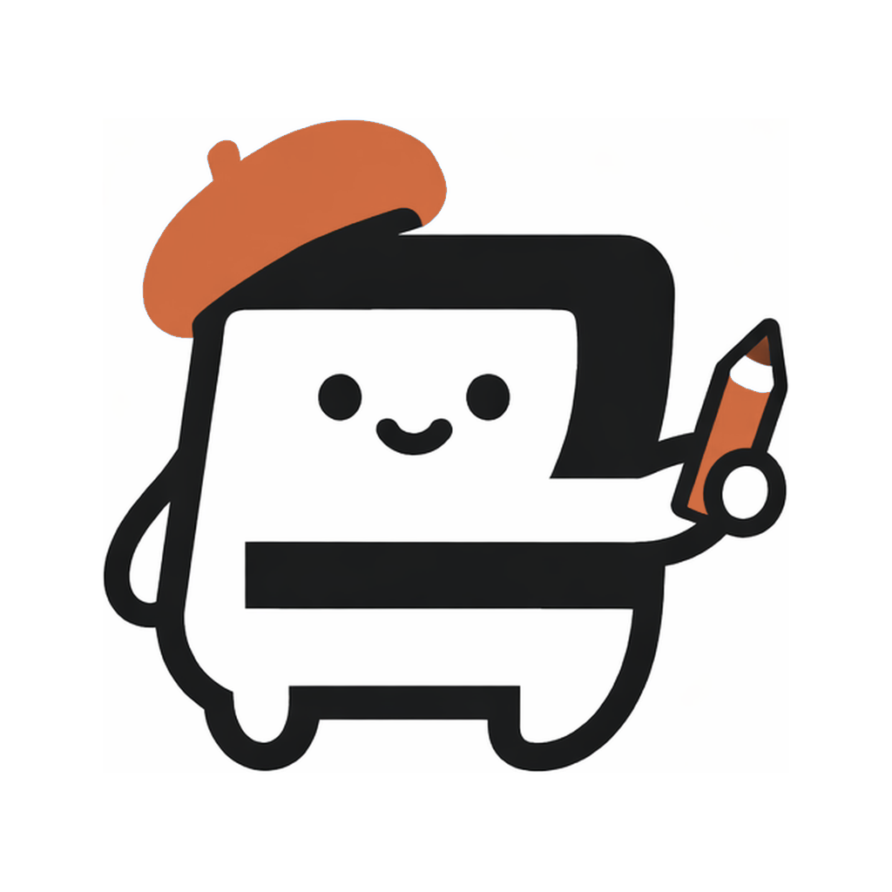
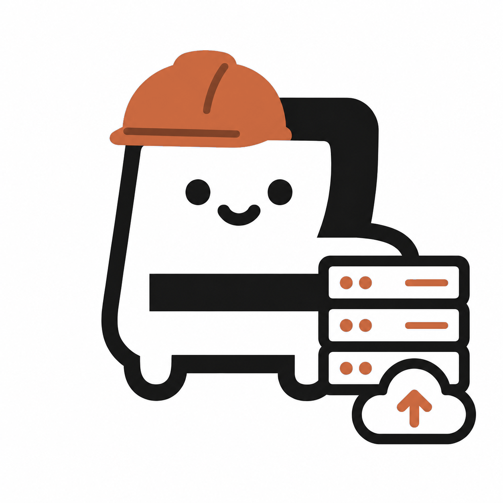
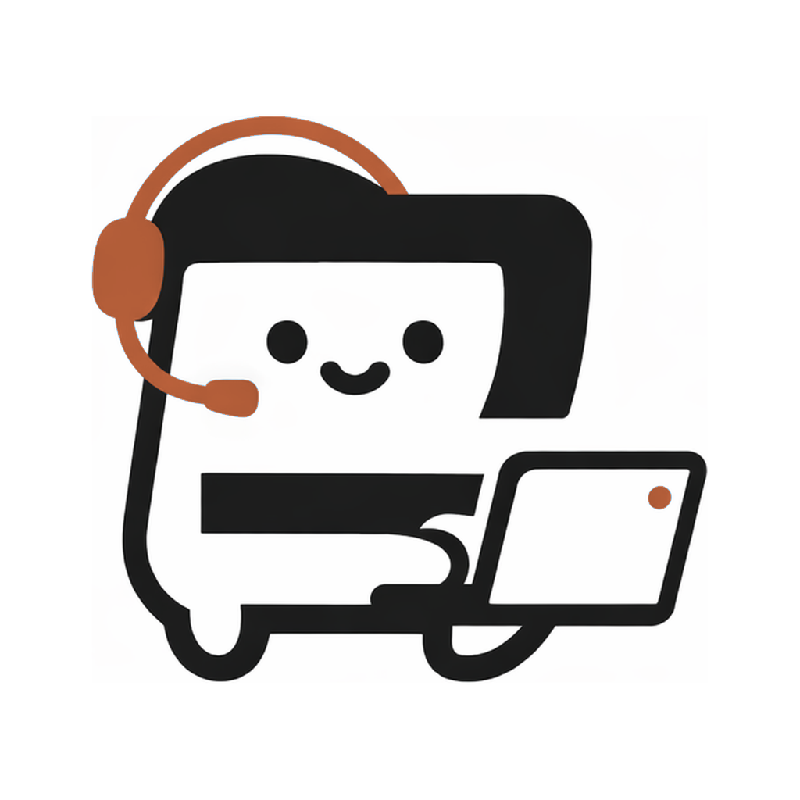
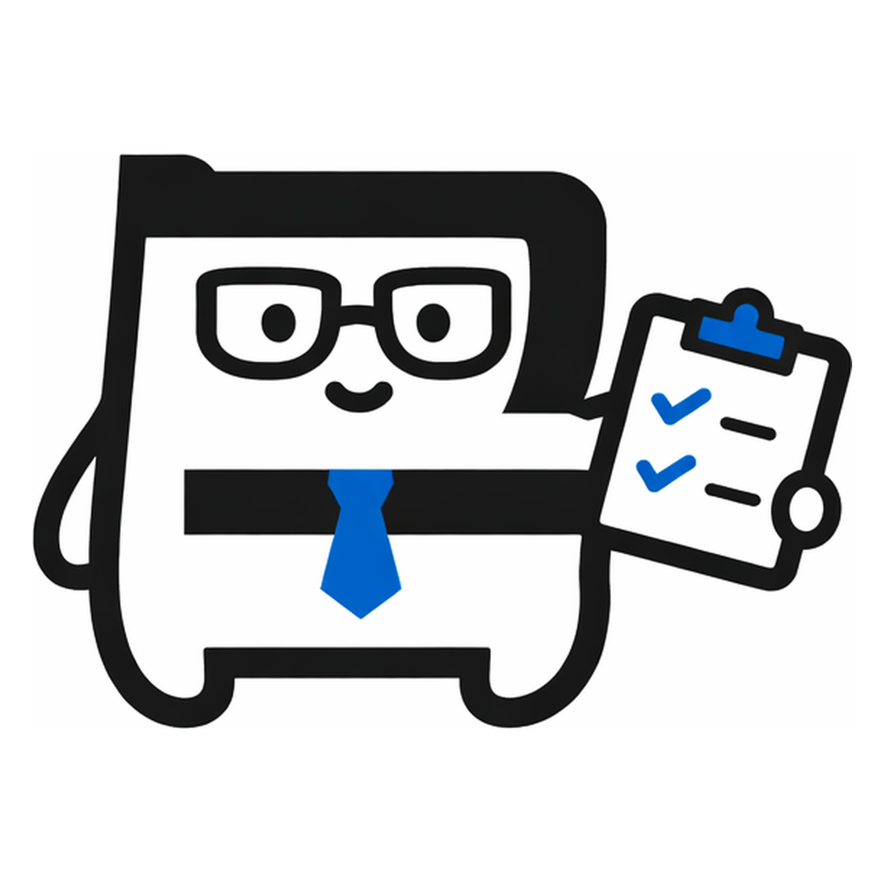

# 그니까 `Geunikka`

  

> 사소한 불편함을 서비스로 만드는 팀

### 이름에 담은 뜻

우리 팀은 모두 공감쟁이라, 누군가의 이야기에 자연스럽게 "그니까"라고 반응합니다.  
팀명 **그니까**에는 사람을 먼저 이해하고 공감에서 출발해 해결책을 만든다는 우리의 태도를 담았습니다.

### 팀 구성

| 캐릭터 | 이름 | 역할 |
| --- | --- | --- |
|  | 김승은 | 디자인 |
|  | 권지연 | 인프라 |
|  | 안문주 | 개발 |
|  | 윤지원 | 기획 |

## 프로젝트 REMINDY

### 한 줄 소개

메모를 빠르게 남기면 AI가 내용을 정리하고, 필요한 순간 알림으로 알려주는 리마인드 앱입니다.

### 왜 만들고 있나요?

일상에는 캘린더에 넣기엔 애매하지만 쉽게 잊히는 일이 많습니다.  
REMINDY는 이런 사소하지만 중요한 순간을 놓치지 않도록, 기록부터 알림까지의 과정을 최대한 가볍게 만들고 있습니다.

## 프로젝트 ARCHIVO

### 한 줄 소개

흩어진 링크와 자료를 한곳에 모으고, 나중에 필요한 순간 다시 찾기 쉽게 정리하는 아카이브 앱입니다.

### 왜 만들고 있나요?

좋아 보여서 저장해둔 링크와 자료는 많아지지만, 정작 필요할 때는 어디에 뒀는지 찾기 어렵습니다.  
ARCHIVO는 저장에서 끝나는 아카이브가 아니라, 다시 꺼내 쓰는 순간까지 이어지는 자료 정리 경험을 만들고 있습니다.

---

그거 불편하죠. 저희도 그랬어요.  
그니까, 우리가 만들었어요.
